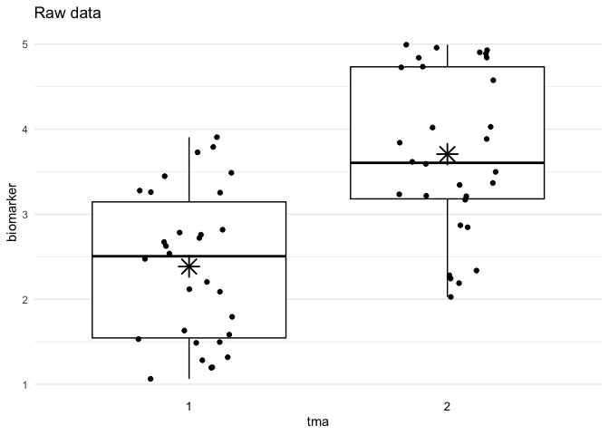

<!-- index.md is generated from index.Rmd. Please edit that file -->

# batchtma R package: Methods to address batch effects

<!-- badges: start -->
<!-- badges: end -->

The goal of the batchtma package is to provide functions for batch
effect-adjusting biomarker data. It implements different methods that
address batch effects while retaining differences between batches that
may be due to “true” underlying differences in factors that drive
biomarker values.

## Installation

batchtma can be installed from [GitHub](https://github.com/) using:

``` r
# install.packages("remotes")  # The "remotes" package needs to be installed
remotes::install_github("stopsack/batchtma")
```

## Usage

Load the package:

``` r
library(batchtma)
```

Define example data with batch effects:

``` r
df <- data.frame(tma = rep(1:2, times = 30),
                 biomarker = rep(1:2, times = 30) + runif(max = 3, n = 60))
```

Run the `adjust_batch()` function to adjust for batch effects:

``` r
df_adjust <- adjust_batch(data = df, markers = biomarker, batch = tma, method = simple)

plot_batch(data = df, marker = biomarker, batch = tma, title = "Raw data")
plot_batch(data = df_adjust, marker = biomarker_adj2, batch = tma, title = "Adjusted data")
```



-   The [“Get Started”](articles/batchtma.html) vignette has details on
    how to use the package.

## Methodology

The package implements five different approaches to obtaining batch
effect-adjusted biomarker values. The methods differ depending on what
distributional property of batch effects they address and how they
handle “true” between-batch differences. Such differences can result
from confounding when batches include samples with different
characteristics that are expected to lead to differences in biomarker
levels. They should ideally be retained when performing batch effect
adjustments.

| \#  | `method =`    | Approach                      | Addressed              | Retains “true” between-batch differences |
|-----|---------------|-------------------------------|------------------------|------------------------------------------|
| 1   | —             | Unadjusted                    | —                      | Yes                                      |
| 2   | `simple`      | Simple means                  | Means                  | No                                       |
| 3   | `standardize` | Standardized batch means      | Means                  | Yes                                      |
| 4   | `ipw`         | Inverse-probability weighting | Means                  | Yes                                      |
| 5   | `quantreg`    | Quantile regression           | Low and high quantiles | Yes                                      |
| 6   | `quantnorm`   | Quantile normalization        | All ranks              | No                                       |

-   [“Get Started”](articles/batchtma.html) shows general examples on
    the different methods in absence and presence of confounding.

## Reference

Stopsack KH, Tyekucheva S, Wang M, Gerke TA, Vaselkiv JB, Penney KL,
Kantoff PW, Finn SP, Fiorentino M, Loda M, Lotan TL, Parmigiani G\*,
Mucci LA\* (\* equal contribution). Extent, impact, and mitigation of
batch effects in tumor biomarker studies using tissue microarrays.
*bioRxiv*
[doi:10.1101/2021.06.29.450369](https://doi.org/10.1101/2021.06.29.450369).
